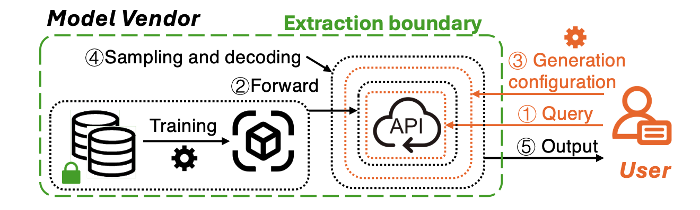
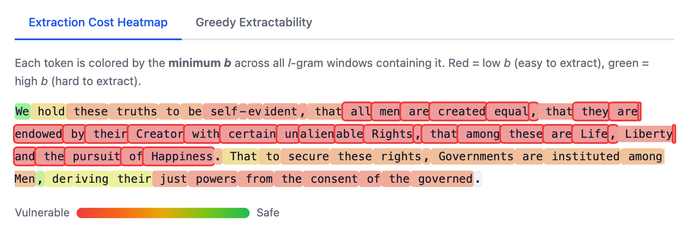

# Inextractability

> **Beyond Indistinguishability: Measuring Extraction Risk in LLM APIs**
> Ruixuan Liu, David Evans, Li Xiong
> *IEEE Symposium on Security and Privacy (S&P), 2026*

Existing privacy notions like differential privacy and membership inference focus on *indistinguishability* — whether a sample was in the training set. But indistinguishability does not imply that a model's API cannot *reproduce* protected content verbatim. This tool implements **(l, b)-inextractability**, a complementary metric that directly measures how much effort an adversary needs to extract memorized text from a black-box LLM API.

**Data holders and regulators** can use it to audit whether an LLM API could leak their copyrighted or sensitive content, and quantify the worst-case extraction risk. **Model trainers** can use it for internal auditing before deployment — evaluating how training, API access controls, and decoding configurations affect extraction risk, and mitigating potential violation risks proactively.



## Interactive Demo

Try the algorithms directly in your browser — no install, no GPU required:

**[Launch Demo](https://emory-aims.github.io/Inextractability/)**

[](https://emory-aims.github.io/Inextractability/)

## Installation

```bash
pip install -e .
python examples/quick_demo.py          # runs both algorithms on built-in sample text
```

## Algorithms

### Algorithm 2 – Rank-Aware Estimation of Extraction Cost

Given a model and a protected dataset $D_{\text{pro}}$, estimates how many bits of computation an adversary needs to extract a memorised span. Iterates over all sequences and all *l*-gram windows, returning `b = -log2(max_z p_z)`.

```python
from inextractability import estimate_extraction_cost

# Single text
result = estimate_extraction_cost(model, tokenizer, "some text", l=50, m=20)

# Dataset (list of sequences, matching Algorithm 2 in the paper)
result = estimate_extraction_cost(model, tokenizer, ["text1", "text2", ...], l=50, m=20)
# result = {"b": float, "p_star": float, "worst_seq": int, "worst_span": (start, end), "per_sequence": [...]}
```

### Algorithm 3 – Efficient Estimation for Greedy Generation

Estimates the fraction of *l*-gram windows that are greedily extractable (all token ranks equal 1) across the entire dataset. Uses a skip optimisation for efficiency.

```python
from inextractability import estimate_greedy_rate

# Single text
result = estimate_greedy_rate(model, tokenizer, "some text", l=50)

# Dataset (list of sequences, matching Algorithm 3 in the paper)
result = estimate_greedy_rate(model, tokenizer, ["text1", "text2", ...], l=50)
# result = {"eta": float, "n_extractable": int, "n_total": int, "per_sequence": [...]}
```

## Examples

```bash
# Quick demo (both algorithms, built-in text, GPT-2)
python examples/quick_demo.py

# Algorithm 2 – single text
python examples/estimate_b.py \
    --model gpt2 --text "The quick brown fox jumps over the lazy dog" --l 5 --m 20

# Algorithm 2 – dataset from file (one sequence per line)
python examples/estimate_b.py --model gpt2 --file data.txt --l 50 --m 20

# Algorithm 3 – single text
python examples/estimate_greedy_rate.py \
    --model gpt2 --text "The quick brown fox jumps over the lazy dog" --l 5

# Algorithm 3 – dataset from file
python examples/estimate_greedy_rate.py --model gpt2 --file data.txt --l 50
```

## Parameters

| Parameter | Default | Description |
|-----------|---------|-------------|
| `l`       | 50      | Sliding window length (l-gram span) |
| `m`       | 20      | Rank threshold for Algorithm 2; set $m$ as the number of tokens for the worst-case risk evaluation |

## Citation

```bibtex
@inproceedings{liu2026inextractability,
  title     = {Beyond Indistinguishability: Measuring Extraction Risk in LLM APIs},
  author    = {Liu, Ruixuan and Evans, David and Xiong, Li},
  booktitle = {IEEE Symposium on Security and Privacy (S\&P)},
  year      = {2026}
}
```

## License

This project is licensed under the MIT License – see [LICENSE](LICENSE) for details.
